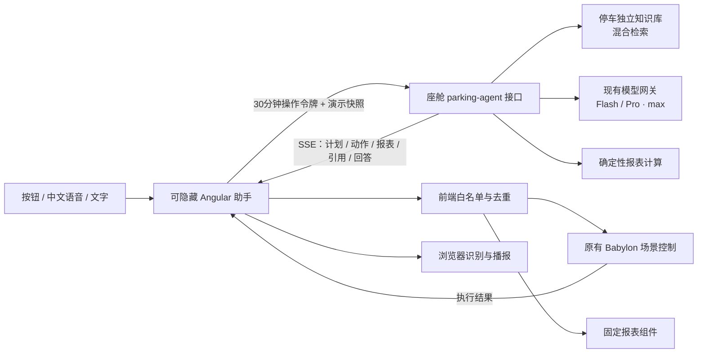

# 三维停车智能体与企业智能座舱集成方案

日期：2026-10-03

## 1. 目标与落地范围

保留全屏 Babylon.js 园区、精细模型、开场动画、三辆巡行车、转动的车轮和固定尾随相机；助手作为可隐藏的浮层叠加，不挤占画布、不改写场景引擎。手机继续使用精细移动 LOD 和自动横向布局。

后端直接扩展 `enterprise-ai-cockpit` 原有 Spring Boot 进程，复用 DeepSeek、操作密码、MySQL 知识文档、pgvector 与混合检索；没有新增 Java、Node 或 Python 常驻服务。默认 Flash + thinking max，Pro 仍为验证操作密码后的可选模型。

本版本交付：

| 用户流程 | 示例 | 实际动作与反馈 |
| --- | --- | --- |
| 访客到院 | 定位门诊停车区 | 镜头飞到现有 A 区，原有分区卡显示空位 |
| 泊位决策 | 推荐停车区 | 根据请求时的模拟快照计算空位，定位空位最多的分区并展示推荐卡 |
| 运营看板 | 查看停车报表 | 总容量、占用、空余、占用率和分区条形图；显示采样时刻、支持刷新 |
| 异常巡检 | 展示急诊区，并列出告警 | 模型规划定位 C 区与告警卡两个工具；管理人员点击告警再定位 |
| 出入核验 | 查看出入记录 | 显示最近 30 条模拟记录；原有记录面板保留筛选和 CSV 导出 |
| 首次使用 | 开始园区导览 | 全景 → A → B → C → 全景，逐站讲解；暂停、继续、结束均可立即操作 |
| 视角体验 | 跟随巡行车 / 切换俯视 | 复用原有车辆尾随与俯视控制，没有另一套相机状态 |
| 语音交互 | 你好停车助手，查看停车报表 | 用户先开启监听；唤醒词显示对话框并提交请求，回答可播报和打断 |

上述容量、占用、告警和记录均为 `browser-demo`，没有接入现场设备。业务容量与三维车辆实例数量是不同口径。泊位推荐目前只按空余数量排序；不虚构收费、无障碍车位、充电桩、真实拥堵或医院政策。

## 2. 技术架构



### 为什么场景工具没有另起 MCP 服务

相机、巡行车、用户选区是每个浏览器独有的状态，适合由前端执行器操作。后端只提出经过校验的计划，前端真正执行并显示结果。共享的现场设备、收费库、车位系统以后可以作为座舱 MCP 或数据源接入；两种工具边界分开，避免把浏览器对象伪装成远程服务。

### 为什么没有直接套用大框架

[AG-UI](https://github.com/ag-ui-protocol/ag-ui) 提供事件驱动、前端工具、状态同步的交互设计。本项目借鉴这些边界，使用小型 SSE 事件合同；当前不是完整 AG-UI 标准实现，后续可增加标准协议适配层。

[CopilotKit](https://github.com/CopilotKit/CopilotKit) 的前端助手与生成式 UI 思路值得借鉴。这里采用原生 Angular 隐藏面板、预制报表和受控场景动作，保持现有 Java 服务与 Babylon 技术栈，没有为了聊天框另部署运行时，也没有复制框架代码。

## 3. 接口和工具合同

生产地址前缀：`https://caibinice.com/smartCockpit/api`。

| 接口 | 用途 | 访问约束 |
| --- | --- | --- |
| `GET /parking-agent/catalog` | 查询工具和模型目录 | 只读，无知识写入 |
| `POST /action-auth/verify` | 验证原座舱操作密码 | 返回 30 分钟令牌 |
| `POST /parking-agent/knowledge/bootstrap` | 幂等导入停车知识库的 5 篇指南 | 原有操作令牌；已有同标题文档保持不变 |
| `POST /parking-agent/stream` | 知识检索、工具规划与报表 | 原有操作令牌，SSE |

请求包含有限长度的提问、最多 8 条近期对话、A/B/C 三个分区、最多 30 条记录和 10 条告警，以及采样时间、场景是否就绪、上次执行反馈。服务只检索 `smart-parking-agent-v1` 知识库；该库尚未配置时也不退回检索所有企业知识。

事件：`meta` → `plan` → `action` / `report` → `references` → `answer` → `done`。长请求每 10 秒发送心跳。模型返回结构化完整回答，页面显示规划状态；没有把完成后的文本拆成“假 token 流”。

工具白名单：

```json
{
  "scene.focus": ["A", "B", "C", "overview", "top", "vehicle"],
  "report.show": ["occupancy", "events", "alerts", "recommendation"],
  "tour.start": ["campus"],
  "tour.pause": ["campus"],
  "tour.resume": ["campus"],
  "tour.stop": ["campus"]
}
```

后端计划最多 4 项，未知工具、未知坐标、额外参数、格式异常使整个计划回退，不部分执行。前端再校验类型、目标、计划匹配和动作 ID 去重。不会执行模型给出的 JavaScript、HTML 或任意坐标。请求取消、隐藏正在规划的助手、页面离开后续动作都停止。

精确快捷指令使用确定性路径，减少模型费用和延迟；自由表达、复合请求和知识问答交给现有模型网关。报表和推荐始终由服务计算，快照过期或数量越界时提示刷新。模型网关未开启或规划异常时，清楚标记本地知识指南，不声称调用了实时模型。

## 4. 知识库组织

5 篇初始文档分别覆盖：分区导览、报表与推荐口径、告警处置边界、出入记录与语音操作、访客和运营流程。元数据带 `domain=smart-parking`、来源、版本和有效状态，复用结构化分块、混合检索与引用。

知识解释“如何办”和“如何统计”；实时数字只取本次数据快照，避免把静态知识中的容量或旧占用量误当实时状态。现有指南可在座舱知识库页面继续维护；幂等初始化不会覆盖人工修改的内容。

## 5. 语音和沉浸交互

- 语音一次提问和语音唤醒分开。默认麦克风关闭，用户主动开启后才识别“你好停车助手”或“停车助手”。隐藏面板时仍有监听状态和停止按钮。
- 使用浏览器 `SpeechRecognition` / `webkitSpeechRecognition`，不调用座舱原有模拟转写接口；音频处理由浏览器的识别服务决定，部分实现会发送音频到浏览器供应商的服务。[MDN SpeechRecognition](https://developer.mozilla.org/en-US/docs/Web/API/SpeechRecognition)
- `speechSynthesis` 使用设备可用中文声音播报，支持立即停止；播报和模型请求期间暂停识别，避免自己听到自己的声音。[MDN SpeechSynthesis](https://developer.mozilla.org/en-US/docs/Web/API/SpeechSynthesis)
- 浏览器缺少识别 API、权限拒绝、网络中断时，保留文字、按钮和支持的播报能力；监听恢复次数有限，页面进入后台关闭监听。
- 停车页面的 Nginx 权限策略仅开放 `microphone=(self)`，保留原安全响应头，博客等页面继续关闭麦克风。[MDN microphone policy](https://developer.mozilla.org/en-US/docs/Web/HTTP/Reference/Headers/Permissions-Policy/microphone)
- 导览每站约 14 秒，镜头手动拖动会暂停自动导览；停下后保持当前位置。进入纯净模式结束导览并关闭监听，原有全屏体验不被信息层覆盖。

## 6. 拓展路线

| 优先级 | 业务拓展 | 实施要点 / 验收口径 |
| --- | --- | --- |
| P1 | 接入真实车位与出入流水 | 同一座舱内新增停车数据适配器，后端查询权威数据，不接收浏览器作为生产统计源；明确数据时效和缺失状态 |
| P1 | 访客、安保、运营角色分层 | 从共享操作密码升级到现有平台用户角色；访客只导览，运营查看数据，敏感动作人工确认并审计 |
| P1 | 可维护 POI 与路径图 | 增加真实入口、楼宇、通道、充电/无障碍点；工具用稳定 ID，路径按可通行图计算，不由语言模型编造坐标 |
| P1 | 目的地与空位联合推荐 | 引入距离、车位类型、预约、拥堵和急诊优先规则，结果解释采用哪条业务规则 |
| P2 | 运营异常解释与派单 | 读取告警详情和时序，关联知识制度，生成待审核工单；默认只读，实际设备控制必须经过角色与审批 |
| P2 | 日/周报与多维经营分析 | 使用座舱已有数据源、报表模板、调度服务；停车收入依据真实收费流水，不根据车辆数估算 |
| P2 | 多站点导览与场景导演 | 预置访客、运营巡检、夜间巡检等不同线路，允许用户打断再继续；保留每站可追踪的工具反馈 |
| P2 | 完整 AG-UI 适配 | 将本地事件映射到标准工具调用、状态快照和消息事件，方便将来替换助手 UI；仍保留本地执行白名单 |
| P2 | 低延迟全双工语音 | 参考 LiveKit Agents 的语音链路与打断模型，评估现有服务器资源和浏览器支持后再接入，避免在 2GB 主机盲目新增重型语音服务 |
| P3 | 场景截图和视觉问答 | 先选定实际支持图像输入的模型，截取当前视角作为有边界的视觉上下文；不假定目前文本模型拥有视觉能力 |
| P3 | 知识质量与体验评测 | 建立定位正确率、报表数值一致性、首个事件延迟、导览完成率、语音唤醒误触发率和权限失败率的评测集 |

业务流程由本地停车场已有能力推导，不表示上述后续项目已实现。[LiveKit Agents](https://github.com/livekit/agents) 可作为实时语音演进参考；[Gods-eye-view](https://github.com/Wheelers-Media/Gods-eye-view) 的语音操纵 3D 场景与导览思路适合参考，但没有移植其地球渲染或外部数据系统。

## 7. 发布与回滚

1. 前端执行类型检查、测试、资产审计与生产构建；后端执行完整 Maven 测试和打包。
2. 先更新原 `enterprise-ai-cockpit` 服务，再以操作令牌幂等导入停车知识库。
3. 停车静态发布使用原 Nginx 原子目录切换，更新专用 SSE 路由和停车页面权限策略；`nginx -t` 失败自动恢复。
4. 核验桌面/移动页面、真实模型复合请求、快捷报表、导览、授权保护以及车辆运动与清晰度。

仓库快照：`E:\Documents\AI\codex\backups\parking-agent-20261003`。停车发布脚本输出对应远端 Nginx 备份和前一个静态 release，可恢复配置并切回旧目录。座舱可切回原 `current` release 后重启同一服务；初始化只新增独立知识库，不更改其他知识文档。
