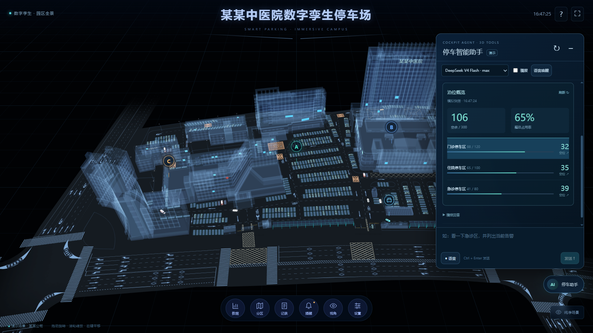
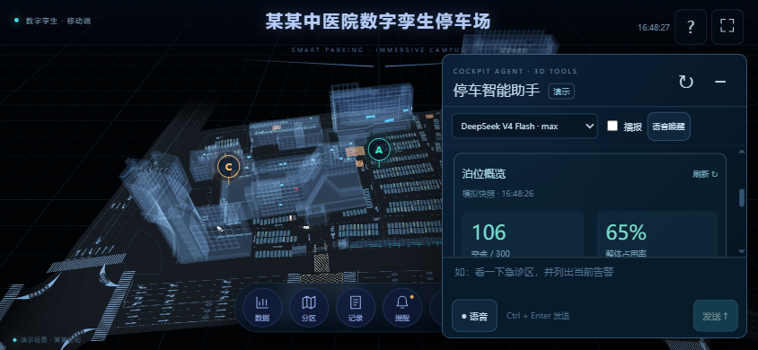

# 停车智能助手联调与发布验证

验证日期：2026-10-03。范围包含三维前端、现有企业智能座舱服务及共享 Nginx 路由。

## 已交付范围

- 默认隐藏的桌面/移动助手，不改变原三维画布尺寸、车辆模型与巡行算法。
- 复用座舱操作密码和模型网关，Flash + thinking max 默认，Pro 可选。
- 分区定位、全景/俯视/车辆尾随、停车报表、空位推荐、出入记录、运行告警，以及可暂停/继续/终止的园区导览。
- 原座舱进程内新增接口和独立停车知识库，5 篇业务指南已幂等导入；没有新增后端常驻服务。
- 浏览器语音提问、主动开启的唤醒词识别、回答播报和立即停止播报。模型请求和播报期间暂停识别，避免回声触发。

## 自动化与浏览器验证

| 验证层 | 结果 | 主要覆盖 |
| --- | --- | --- |
| Java 后端完整 Maven 测试 | 47 项通过 | 原有能力回归；停车请求校验、知识隔离、白名单、统计计算、授权保护 |
| 停车前端单元测试 | 15 项通过 | SSE 分帧、动作/报告合同、唤醒词、原有数据和车辆算法 |
| Nginx 路由更新脚本 | 2 项通过 | 更新幂等、保留其他项目路由、格式异常拒绝写入 |
| 类型检查、生产构建、资产审计 | 通过 | 停车 Angular、座舱 Vue、模型纹理/名称/实例契约 |
| 本地桌面交互 | 26 项通过 | 授权、真实 UI 流程、复合动作、无效计划整体拒绝、导览中断、语音状态机、取消请求、纯净模式 |
| 本地移动交互 | 8 项通过 | 横屏/竖屏适配、滚动卡片、画布清晰度、车辆尾随、面板隐藏 |
| 车辆专项回归 | 17 项通过 | 三车自动巡行、车头方向、四轮及轮毂转动、固定距离/高度尾随、手动操作与车辆拾取 |
| 线上接口 | 12 项通过 | TLS、SSE、未授权 401、确定性报表、真实 DeepSeek 复合计划、停车知识引用 |
| 线上桌面/移动浏览器 | 22 项通过 | 实际模型操作急诊区镜头和告警、导览、隐藏面板、原车队交互、移动适配、无运行时异常 |
| 最终静态 release 复验 | 6 项通过 | 最新 hash、HTTPS、初始隐藏、桌面/移动报表和面板布局、无运行时异常 |
| 平台路由 | 8 个地址返回 200 | 博客首页/文章、停车桌面/移动、座舱/健康接口、量化、跨境报告 |

线上自由表达请求实际调用现有 DeepSeek 网关，成功生成“定位急诊区 + 查看告警”两项动作，并返回停车知识依据。快捷报表走确定性计算路径，不消耗模型规划调用。占用率与空余数经过提交快照比对，来源标记为浏览器演示数据。

语音状态机测试使用可控的浏览器 API 替身，验证主动开启、忽略环境闲聊、唤醒、播报、打断、停止和销毁；线上核验 HTTPS、麦克风权限策略以及浏览器识别/播报 API 可用性。**本次自动化没有采集真实人声，也没有据此宣称真实设备的识别准确率或语音延迟已经验收。** 实际识别受浏览器、音频设备、权限和识别服务网络影响，文字和业务按钮始终保留。

导览只控制已有场景点位；告警为只读解释与人工核验建议。当前没有连接真实收费、抬杆或医院业务系统，未把模拟数字包装为生产统计。

## 线上效果

桌面画布不缩小，助手可随时隐藏：

移动横屏采用独立可滚动面板，保留原精细场景：

## 发布记录和回滚

| 项目 | 本次最终 release | 本次更新前 release |
| --- | --- | --- |
| 停车静态站点 | `/opt/3d-smart-parking/releases/20261003085627` | `/opt/3d-smart-parking/releases/20261002230943` |
| 企业智能座舱 | `/opt/enterprise-ai-cockpit/releases/20261003083603-ed1cc29-working` | `/opt/enterprise-ai-cockpit/releases/20260818022052-bcf9458-working` |

第一次静态发布因远端 Python 3.6 不支持新语法触发自动回滚，原页面保持可访问；路由更新脚本修复兼容后重新发布成功。最后一轮静态更新修正语音停止提示，前一个已验证的助手 release 为 `/opt/3d-smart-parking/releases/20261003083944`。

- 本地仓库更新前快照：`E:\Documents\AI\codex\backups\parking-agent-20261003`。
- 远端座舱环境、原服务单元和 Nginx 备份：`/opt/enterprise-ai-cockpit/backups/parking-agent-20261003`。
- 停车路由变更前配置备份：`/opt/3d-smart-parking/nginx-routes-20261003083944.retry-backup`。
- `nginx -t` 通过，`nginx`、`enterprise-ai-cockpit`、`ai-quant-api`、`crossborder-trend` 均为 active。
- 停车页面仅开放同源麦克风权限，原 HSTS、nosniff、SAMEORIGIN 等响应头保留，博客继续关闭麦克风。

回滚静态文件时将 `/opt/3d-smart-parking/www` 原子切回指定旧 release；回滚座舱时将 `current` 切回原 release 并重启原服务。恢复 Nginx 配置前先保存现状，执行 `nginx -t` 成功后 reload。独立停车知识库仅新增文档，不覆盖其他企业知识。

更多业务流程、接口合同和 GitHub 项目参考见 [智能体设计与拓展方案](parking-agent-design.md)。
