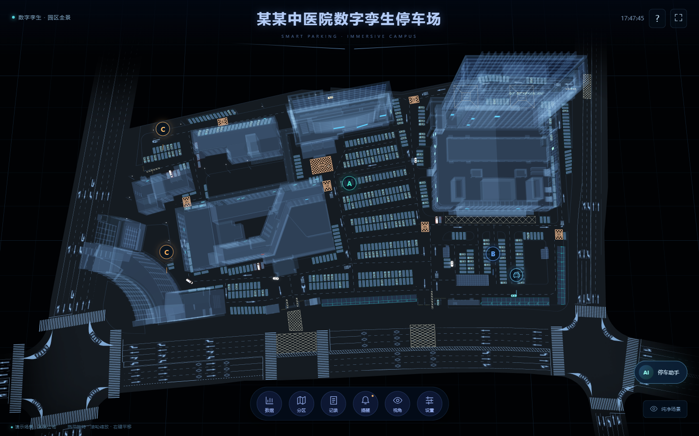

# 停车区域校准与保真渲染工程

日期：2026-10-04。默认资产和全屏沉浸交互保持不变；优化以可测量、可回退为前提。

## 1. B、C 区的空间校准

垂直俯视使用右手坐标和 `alpha=-π/2`，屏幕右侧对应 `-X`，屏幕上方对应 `+Z`。

| 区域 | 模型坐标 X/Z | 俯视位置 | 镜头 |
| --- | --- | --- | --- |
| A 门诊停车区 | 0 / 2 | 中部，保持原位置 | radius 9，beta 0.65 |
| B 住院停车区 | -8 / -2 | A 右侧、大楼下方的右下停车区 | radius 9，beta 0.65 |
| C 急诊停车区主点 | 10.8 / 5.2 | 左上停车区 | 与左侧共用区域镜头 |
| C 左侧辅助点 | 10.2 / -1.9 | 左侧停车区 | center 10.6 / 2.4，radius 15.5，beta 0.42 |



`campus-layout.json` 是坐标单一来源，座舱后端资源与其逐字同步。17 个节点保持老 ID，新增左侧道路连接点和 `parking-c-side`。C 辅助点类型为 `service`，共用 C 区 80 个泊位，不重复参与容量与推荐候选统计。定位按钮、AI 点位、路径末点和巡检导览同步更新。启动应用不改写已有数据库图；发布时管理员备份旧图，使用乐观锁版本显式更新。

## 2. 本轮落实的渲染优化

### 单批次空间筛选

126 辆停放车按 6 个模型单位划分为 14 个空间单元，使用保守球体视锥检查。可见实例少于总数 60% 时，按原全局顺序压紧每个车身部件的同一 thin-instance 缓冲；否则保持原 126 辆批次。仅在可见集合或 LOD 集合变化时上传矩阵，不每帧重传。

不克隆共享 geometry，避免 Babylon 的实例矩阵顶点属性相互覆盖；透明玻璃顺序、原布局包围盒和全局拾取 ID 保留。近景样本由 126 个提交实例减至 32 个，Draw Call 仍为 174。薄实例的用法以 [Babylon.js 官方文档](https://doc.babylonjs.com/features/featuresDeepDive/mesh/copies/thinInstances/) 为依据。

### 首屏 shader 与 Glow 预热

模型、车轮、招牌和材质准备后，对普通与 thin-instance 材质变体分别预编译；等待场景 ready，再执行两帧正确的 `beginFrame → render → endFrame`。预热藏在保留的原开场动画后，不提前推进车辆。WebGPU 仍为显式选项；未开放能力时回到 WebGL，初始化完成后才加载模型。

### 按需性能采样

隐藏设置可开启 CPU 整帧、Glow RTT、不透明/透明提交和裁剪采样。GPU 使用整帧 timer query，和 CPU 数值分开；查询缺失、样本不足或驱动返回明显异常近零值时显示未形成有效样本。当前 GPU 指标是**整帧**，不是逐 pass GPU 耗时。关闭采样会解除观察者和 GPU 查询。

### 可选 KTX2 纹理

新增 UASTC quality 3、无 RDO、带 mip 的独立资产，不替换原四个 GLB。颜色 PSNR 门槛 43 dB、法线 48 dB；带 alpha 的招牌/贴图、小尺寸和不适用贴图保留原字节。顶点、索引、UV、法线、材质参数和节点姿态均做校验。KTX2 通过运行时转码使用设备支持的压缩纹理格式，背景见 [Khronos KTX 说明](https://www.khronos.org/ktx/)。

解码 JS/WASM 固定为 Babylon 9.29.0 并自托管，哈希写入 manifest；优先 BC7/ASTC，不具备能力时保留高质量 RGBA 路径。导入失败清理本次新增资源，再加载原模型。实际本机测试观察到 BC7 格式 36492。UASTC 文件比原 PNG/JPEG 模型更大，目标是纹理显存优化，不声称下载加速；也未把纹理估算当成驱动显存实测。

### 可选远景车模

使用 [meshoptimizer](https://github.com/zeux/meshoptimizer) 保守简化索引，所有顶点属性保留；透明玻璃、灯具拓扑和材质不改。桌面三角形 24,221 → 22,469，手机 21,249 → 20,897，最大模型世界误差约 0.000032，小于 0.0002 预算。仅投影尺寸小于 32 **物理像素**的停放车辆使用远景变体；近景、特写和三辆巡行车始终保留原几何。

### 只读模型审计

[几何审计报告](model-geometry-audit.json) 统计原始 GLB 的三角形、透明材质、退化面、唯一纹理和矩阵。园区原资源存在 33 个退化三角形，本轮记录而不直接删除，以免改变既有绘制效果。`audit-model-blender.py` 提供只读 Blender 导入/报告入口，不应用修改器、不导出覆盖。当前机器没有 Blender/BlenderMCP，本轮实际执行的是 glTF 数据审计，不宣称执行 Blender 优化。

## 3. 可重复验证

```powershell
npm run typecheck
npm test
npm run build
npm run sync:layout
npm run audit:geometry -- --output docs/model-geometry-audit.json
# 可选资产只输出到暂存目录；审阅后再复制。
npm run prepare:render -- --output-dir "E:/Documents/AI/codex/tmp/parking-variants" --encoder "FULL_PATH_TO_TOKTX.exe"
```

前端 32 个单元测试、原资产审计和 6 个变体/解码器哈希审计通过；座舱后端 58 个测试通过。依赖审计为 0 漏洞。原四个 GLB 的哈希未改变。三辆巡行车实际运行均有位置和轮胎角度变化，90 帧采样中尾随水平距离为 0.65、相对高度为 0.25，浮点误差小于 10⁻¹⁵。

图像对照固定相机、时刻、车辆位置、轮胎角度，隐藏 UI 后截取 overview/building/parking/vehicle 四个视角，显式更新空间筛选再渲染：

| 配置 | 桌面 1440×900 CSS / 2880×1800 渲染 | 手机视口模拟 844×390 CSS / 1688×780 渲染 |
| --- | --- | --- |
| 默认原资产 + 空间筛选 | 四视角逐像素一致 | 四视角逐像素一致 |
| KTX2 + 远景 LOD | PSNR 46.01–64.81 dB | PSNR 45.89–62.45 dB |
| 仅手机远景 LOD | — | 近景完全一致；远景最大改变通道比例 0.040% |

KTX2 是有损高质量选项，不把它写成无损。手机结果为浏览器视口模拟，不等同于真机温度/续航测评。WebGPU 本机初始化和预热后正常运行；模拟隐藏 `navigator.gpu` 可回退 WebGL。中断两个 KTX2 模型请求后可回退原图，资源数恢复到默认的 121 Mesh；故障注入的网络错误与正常访问结果分开记录。

Intel UHD / Chrome WebGL2、2880×1800 渲染下的单次稳定镜头 CPU 采样（120 样本窗口）：

| 视角 | 原批次 CPU 整帧 ms | 空间筛选 CPU 整帧 ms | 提交实例变化 | Draw Call |
| --- | ---: | ---: | --- | ---: |
| 全景 | 4.115 | 3.856 | 126 → 126 | 242 → 242 |
| A 区 | 3.155 | 3.184 | 126 → 126 | 146 → 146 |
| 车辆近景 | 2.550 | 2.017 | 126 → 32 | 174 → 174 |

近景本次 CPU 样本约减少 20.9%，大视角没有统一收益承诺；GPU 基准部分查询无效，未据此计算 GPU 提升。完整数值见 [验证数据](rendering-phase2-validation.json)。

## 4. 发布与回退

后端纯增量发布保留现有 Vue/MCP、app.env、systemd 和其他业务服务，健康检查失败回旧 release；停车静态发布备份 Nginx 并原子切换。KTX2 的版本化 WASM 使用 `application/wasm`、静态 gzip 和一年缓存。原图/几何回退不依赖外部 CDN。

- 默认：`/smartParking/`、`/smartParking/mobile`。
- 显式试验：`?textures=ktx2&lod=far`、`?renderer=webgpu`。
- 诊断：`?profile=1`；恢复整批实例 `?instances=single`。
- 关闭试验：在“设置”选择原纹理、关闭远景 LOD、选择 WebGL，或移除对应 URL 参数。
- 发布前本地备份：`E:/Documents/AI/codex/backups/parking-render-phase2-20261004`。
- 停车 release：`20261004102223`；后端 release：`20261004101928-46fd7a0-backend`。
- 原停车 release：`20261004032637`；Nginx 备份：`/opt/3d-smart-parking/nginx-routes-20261004102223.backup`。
- 原后端 release：`20261003171856-66bb028-working`；服务器私有配置备份：`/opt/enterprise-ai-cockpit/backups/20261004101928-46fd7a0-backend`。
- 在线图为 version 2 / 17 节点；仅补入 1 篇区域指南，知识库共 14 篇；一年合成账本未重新生成。
- 线上 31 项 API 回归通过，包含两个真实 Flash 复合计划、权限、账本、推荐、路线、三类导览与知识检索；未新增测试工单。
- 8 个正确项目/博客入口 HTTPS 返回对应页面，26 个模型/解码文件 SHA-256 与本地匹配，WASM MIME 与缓存正确。桌面 B/C 定位、移动横屏/竖屏旋转及业务台左侧 C 路线已在浏览器验证，默认画布分辨率保持不变，正常访问控制台 0 错误。
- 线上手机 KTX2 + far LOD 可加载，解码资源全部同源，正常控制台 0 错误；桌面 WebGPU 也完成初始化/预热并渲染原场景，0 错误/0 警告，无外部解码/着色器资源。此项不等同于长期真机稳定性测评。完整 release、路由末点、哈希、服务健康和 API 证据在上述 JSON。

## 5. 下一轮仍需设备证据的方向

1. 真机 Android/iOS 的 ASTC、解码峰值、显存、功耗与横屏采样，再决定是否默认开启 KTX2。
2. 原生 GPU 逐 pass 计时与 Glow 分辨率/模糊核对照，避免把 CPU 提交耗时误读为 GPU 开销。
3. 安装 Blender/连接 BlenderMCP 后只读检查法线、退化面和重复材质；所有候选修改先输出副本并走八视角对照。
4. 建筑远景 HLOD/遮挡优化先保护窗户、招牌和透明立面，再做可选变体；本轮未直接减面园区默认模型。
