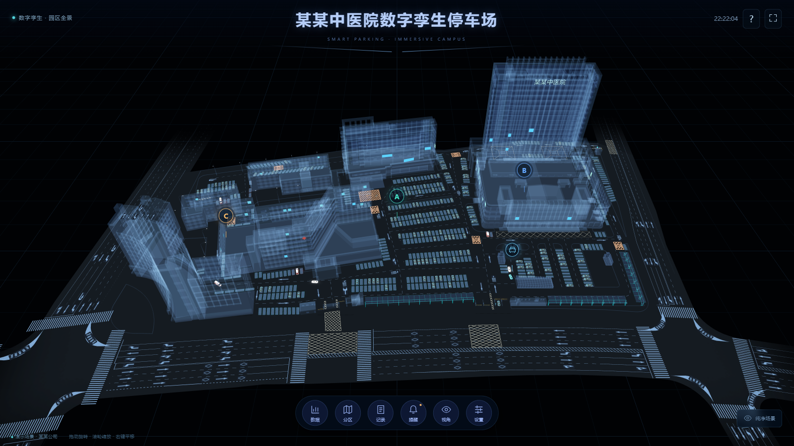
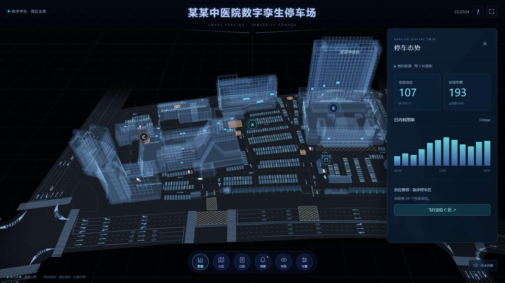
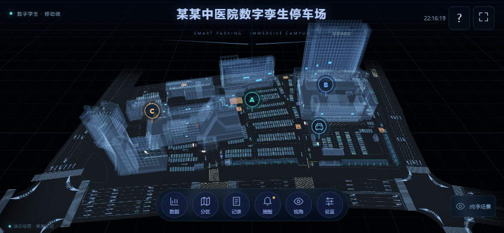
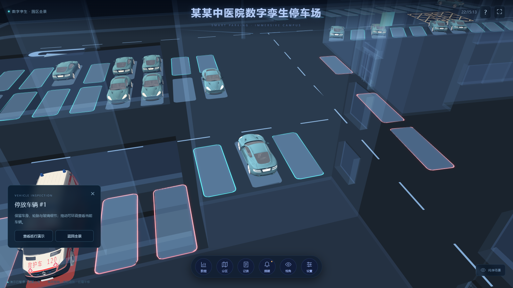
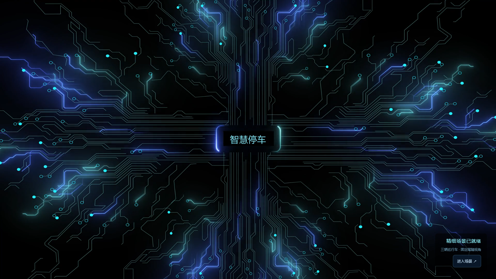
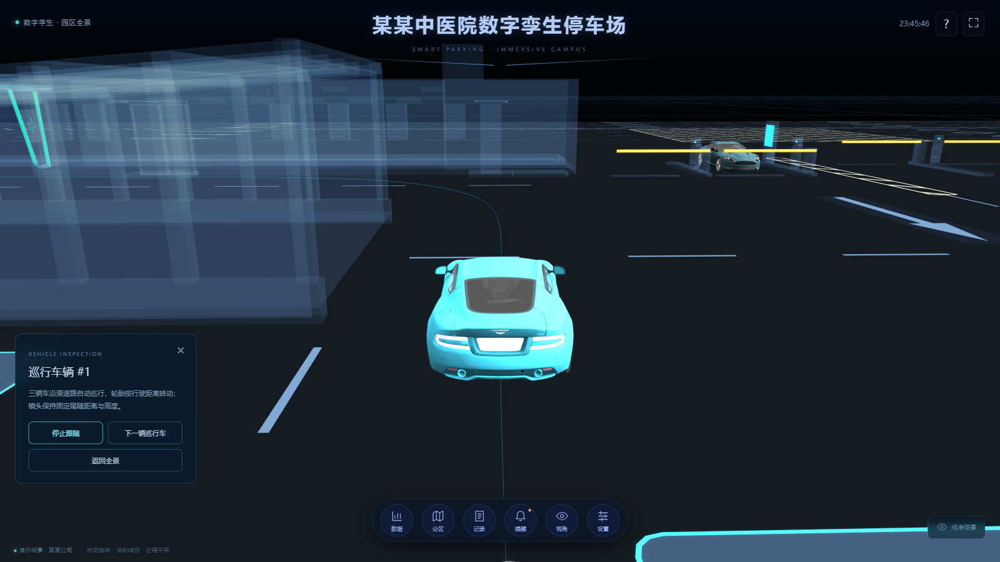
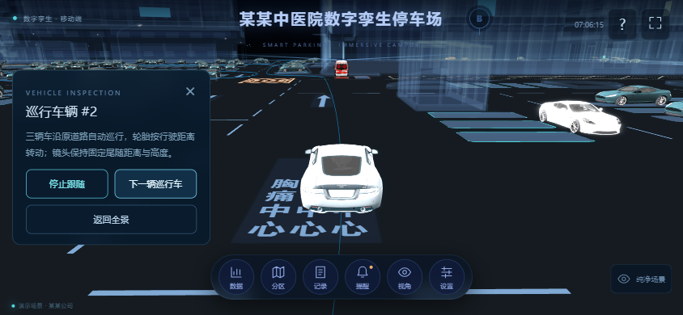

# 验证记录

更新：2026-10-03。环境：Windows、Node 24.14.1、Chrome。手机检查使用浏览器视口与 CDP 触控模拟；先记录 10 月 2 日首轮结果，最新车辆回归结果见末尾。

## 本地检查

| 检查 | 结果 |
|---|---|
| TypeScript | 通过 |
| 数据测试 | 4 项通过：总量、3000 次守恒/边界、画质档位、像素预算 |
| 精细资产审计 | 4 个 GLB 通过；园区 18 / 车辆 7 个纹理；手机与桌面材质层次一致 |
| 名称与几何脱敏 | 清理原招牌、3883 个内嵌文字三角面、旧元数据、水印与品牌车牌；近景检查 |
| 实例和轨迹 | 126 个有限矩阵；200+ 时间递增的道路采样帧 |
| 默认界面 | 0 个信息浮层；画布 1600×900，实际渲染 3200×1800 |
| 图表浮层 | 点击出现；关闭隐藏；画布始终不变 |
| 交互 | 15 个自动浏览器断言通过，见下方清单 |
| 手机横屏 | 844×390；渲染 1688×780；无页面溢出 |
| 手机竖屏 | 390×844；场景横向 844×390；无页面溢出 |
| 单指与双指 | 竖屏逆变换通过；60px 纵向拖动对应 alpha -0.24，beta 不变；扩张双指半径 25→15.625 |
| 手机资源 | 仅请求 campus-mobile-v2.glb 与 vehicle-mobile-v2.glb，保留精细纹理 |
| Console | 桌面和手机检查无错误/警告 |

15 项断言：默认图表隐藏、全视口双倍像素、图表不挤压画布、记录筛选、CSV 下载、告警确认、区域飞行、俯视、巡航、演示车跟随、暂停、实例拾取、实际车辆近景、纯净模式、Esc 恢复。

本地浏览器抽样：桌面约 36–38 FPS，手机约 25–29 FPS；这些为本机浏览器观测，目标 60/30 为限速策略。新增双面招牌后完整场景 77 个 Mesh。没有以降低原生分辨率来换取帧率。

## 页面效果

## 发布验证

2026-10-02 发布后的复测结果：

| 检查 | 结果 |
|---|---|
| 停车版本 | `/opt/3d-smart-parking/releases/20261002142654` |
| Nginx | `nginx -t` 通过，已 reload |
| HTTPS | 桌面 `/smartParking/`、手机 `/smartParking/mobile` 均正常；未跳过证书校验 |
| HTML 缓存 | `Cache-Control: no-cache`，确保正常刷新取得新版本 |
| GLB | 对应 LOD 两个模型均 HTTP 200、`application/octet-stream`；手机未加载桌面模型 |
| JSON | 道路轨迹 HTTP 200、`application/json` |
| 浏览器断言 | 22 项通过：隐藏图表、全视口与双倍像素、浮层、筛选/CSV、告警、分区、跟随/暂停、77 Mesh、实例拾取、纯净模式/Esc、手机 LOD/横竖屏/浮层、控制台 |
| 像素与性能 | 桌面 3200×1800 / 34 FPS，手机模拟 1688×780 / 24 FPS，为本机线上页面抽样 |
| 控制台 | 0 个错误、0 个警告 |

博客版本：`/opt/ai-blog/releases/20261002143435-15281bc`。中文、英文、日文的项目文章均加载三张新截图，桌面和手机无整页横向溢出，表格使用独立横向滚动；项目卡片和文章演示/源码链接在新标签页打开。博客类型检查、10 项内容测试、46 个 SSG 页面构建通过。

回滚配置：`/opt/3d-smart-parking/nginx-routes-20261002142654.backup`；上一版：`/opt/3d-smart-parking/releases/20261001121429`。
本地修改前备份：`E:\Documents\AI\codex\backups\parking-immersive-20261002\parking-v1.zip`。

## 2026-10-03 车辆、尾随与开场动画回归

| 检查 | 结果 |
|---|---|
| TypeScript / 生产构建 | 通过；生产 base `/smartParking/` |
| 单元测试 | 8 项通过，包含 10,000 组固定尾随姿态与三条完整轨迹循环 |
| 车头方向 | 车模规范为 +Z 前向/+Y 向上；三辆车的实际前向与位移方向点积均大于 0.95 |
| 四轮转动 | 每辆车四个独立轮胎节点，橡胶与轮毂几何均随节点转动；角度由距离/半径驱动 |
| 自动巡行 | 3 辆车、3 条原道路轨迹；初始时间与速度错开；进入场景后自动运行 |
| 固定尾随 | 水平距离 0.65、车上方高度 0.25 个场景单位；620 帧浏览器采样，最大距离偏差约 9×10⁻¹⁶；转弯、路线循环、滚轮操作无漂移 |
| 跟随交互 | 1→2→3→1 切换车辆通过；停止跟随后恢复手动旋转；再次跟随恢复固定姿态 |
| 暂停 | 三辆车的位置和十二个轮胎节点同时停止，恢复后继续 |
| 停放车辆 | 14 个材质/轮胎部件各包含 126 个有限矩阵；实例拾取和真实车辆近景通过 |
| 开场动画 | 10.9 秒 H.264 电路动画；保留动效、文字脱敏，静音自动播放；就绪后自然结束 |
| 慢网与媒体故障 | 延迟模型 7 秒时动画在 5.4 秒前段循环；就绪后可跳过；视频请求主动中止时显示进度并正常进入场景 |
| 手机画质 | 仅请求 campus-mobile-v2 与 vehicle-mobile-v3；1688×780 渲染，121 Mesh，本机浏览器抽样 26 FPS |
| 手机触控 | 单指旋转、双指缩放、横竖屏按钮、固定尾随和车辆切换通过；信息卡未超出视口 |
| 页面回归 | 15 项原业务/图表/拾取检查全部通过；完整本地浏览器检查 46 项通过 |
| 控制台 | 正常桌面与手机检查 0 错误、0 警告；主动中止视频的故障测试出现预期网络错误 |

最新完整场景为 121 Mesh（此前 77 Mesh 为单车静态轮胎版本）。桌面本机抽样 36–39 FPS，3200×1800；保持清晰度策略不变，未通过减少模型精致程度来修复车辆动画。

修改前备份：`E:\Documents\AI\codex\backups\parking-vehicle-20261002\parking-before.zip`。

### 最新线上版本

- 桌面与手机同步 release：`/opt/3d-smart-parking/releases/20261002230943`（release ID 使用 UTC）。
- `nginx -t`、HTTPS 证书验证通过；手机深链接返回 HTTP 200，HTML 校验和与本地产物一致。
- 开场视频 `video/mp4` / HTTP 200，Range 请求返回 206；三条轨迹 JSON 与 v3 两端车模均正常。
- 26 项线上浏览器复测全部通过，涵盖三车切换、跟随/暂停、实例拾取、图表/记录/告警、手机专用 LOD、横竖屏布局；0 错误、0 警告。
- 线上抽样：桌面 3200×1800、44 FPS；手机浏览器模拟 1688×780、26 FPS。两端均 121 Mesh。
- 回滚配置：`/opt/3d-smart-parking/nginx-routes-20261002230943.backup`；上一 release：`/opt/3d-smart-parking/releases/20261002142654`。
